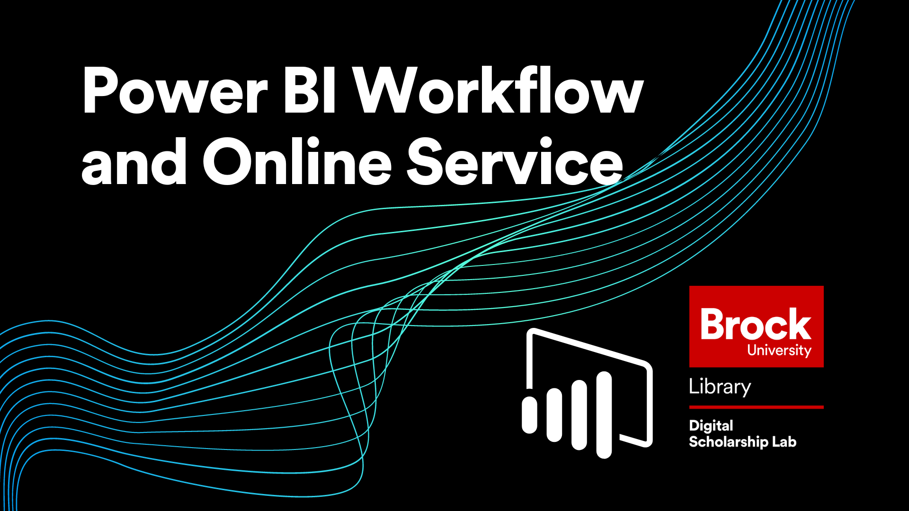

# Introduction to Power BI Service
In this workshop attendees will be introduced to the online portion of Power BI known as Power BI Sevice as well as the basic workflow for working on the platform.

A basic understanding of Power BI is reccomended for this workshop.

*Estimated workshop length: 1 hour*

----

## Setup Instructions
This workshop requires access to the online version of Power BI known as Power BI service.  To access this platform you will need a microsoft account associated with your work or school.  If your organization uses integrated Office 365 (Brock University does this) then you will be able to log in with your institution credentials.

You will also need to install Power BI Desktop on your computer.  Keep in mind that Power BI Desktop is **not Mac compatible** so if you want to participate in this workshop you will need to use a windows computer or set up a windows environment on your Mac computer.  
  
If you do not already have the program you can get it by following these steps (keep in mind that you may need to contact your institution for permission to install programs):

- Go to the [Power BI Desktop download page](https://www.microsoft.com/en-us/download/details.aspx?id=58494) and choose which language you prefer 
- Click the "Download" button and choose the installer that works for your computer  
- Once the download is complete, run the installer and follow the instructions in the setup wizard  
- With that you should be good to go!  

----

## Workshop Tasks

1. Load in the Mahogany Mary Dataset using the web connector and open the Power Query Editor.  
2. Make the following changes to the dataset:  
  a. Check and correct the datatypes for each column  
  b. Create a new column called "Tax Paid" using this formula: **Sale Total*taxrate/(100+taxrate)**  
  c. Create a new column called "Profit" by subtracting Tax Paid from Sale Total  
  d. Close and Apply your changes  
3. Load in the satisfaction dataset using the web connector and check that the datatypes are correct and that the datasets are connected once loaded.
4. Make at least two visualizations that are useful and formatted to be easily read and understood
5. Log in to your Power BI account and then publish your report to "My Workspace"
6. Go to [app.powerbi.com](app.powerbi.com) and familiarize yourself with Power BI service
7. Get some "Quick Insights" on your dataset and pin one of the results to a new Dashboard called "Mahogany Mary"
8. Open your report and pin one of your visuals to your Mahogany Mary Dashboard
9. Create a live link to your report using the share options
10. Go to your dashboard and try asking questions using the Q&A box
11. When all of this is done, type "POWER BI MASTERED!!" in the chat

----

## Next Steps
If you want to delve deeper into what Power BI is capable of, I recommend checking out the official [Power BI learning paths](https://docs.microsoft.com/en-us/learn/powerplatform/power-bi).  
 
 
 
----
  
**This workshop is brought to you by the Brock University Digital Scholarship Lab.  For a listing of our upcoming workshops go to [Experience BU](https://experiencebu.brocku.ca/organization/dsl) if you are a Brock affiliate or [Eventbrite page](https://www.eventbrite.ca/o/brock-university-digital-scholarship-lab-21661627350) for external attendees.**

